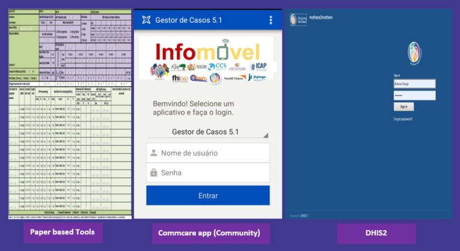

layout: true


---
class: inverse, middle
background-color: #413395
text-color: white
.header[]

## .header[.p[**Agenda**]]

1.	Data Flow 

2.	Routine Data Quality Activities  

3.	Geolocations updates 

---
class: inverse, middle
background-color: #413395
text-color: white
.header[]
  

## .header[.p[**Data Flow **]]
.red1[How data is collected (Paper, App, DHIS2 etc)]

```{r, out.width="100%", fig.align='center', echo=FALSE}

```


---
class: inverse, middle
background-color: #413395
text-color: white
.header[]
  

## .header[.p[**Data Flow **]]
.red1[What happens to data from the site]

```{r, out.width="100%", fig.align='center', echo=FALSE}
knitr::include_graphics("img/work_flow.png")
```


---
class: inverse, middle
background-color: #413395
text-color: white
.header[]


## .header[.p[**Data Flow **]]
.red1[During data entry on DHIS2]


```{r, out.width="90%", fig.align='center', echo=FALSE}
knitr::include_graphics("img/error1.png")
```

---
class: inverse, middle
background-color: #413395
text-color: white
.header[]


## .header[.p[**Data Flow **]]

.red1[During data entry on DHIS2]


```{r, out.width='90%', fig.align='center', echo=FALSE}
knitr::include_graphics("img/error2a.png")
```

---
class: inverse, middle
background-color: #413395
text-color: white
.header[]


## .header[.p[**Data Flow **]]
.red1[During data entry on DHIS2]

```{r, out.width="90%", fig.align='center', echo=FALSE}
knitr::include_graphics("img/error3.png")
```

---
class: inverse, middle
background-color: #413395
text-color: white
.header[]


## .header[.p[**Data Flow **]]
.red1[During data entry on DHIS2]

```{r, out.width='100%', fig.align='center', echo=FALSE}
knitr::include_graphics("img/error4.png")
```


---
class: inverse, middle
background-color: #413395
text-color: white
.header[]


## .header[.p[**Data Flow **]]
.red1[What is the role of country SI team before data is reported to HO]


```{r, out.width='110%', fig.align='center', echo=FALSE}
knitr::include_graphics("img/datacheck1.png")
```


---
class: inverse, middle
background-color: #413395
text-color: white
.header[]


## .header[.p[**Data Flow **]]
.red1[What is the role of country SI team before data is reported to HO]


```{r, out.width="100%", fig.align='center', echo=FALSE}
knitr::include_graphics("img/dataquality.png")
```

---
class: inverse, middle
background-color: #413395
text-color: white
.header[]


## .header[.p[**Data Flow **]]
.red1[Is there data collected and currently not reported to HO ]


```{r, out.width="40%", fig.align='center', echo=FALSE}

```


---
class: inverse, middle
background-color: #413395
text-color: white
.header[]


## .header[.p[**Routine Data Quality Activities **]]
.red1[What are the RDQA steps taken by SI in-country]

<li>RDQA tool was developed  </li><br>

<li>All M&E, Provincial Managers and District Managers were trained  </li><br>

<li>We started to implement in Maputo and some facilities in Zambezia province in December 2019 </li><br>

<li>Our plan was to expand to other provinces and all sites</li><br>

<li>RDQA planned to be conducted quarterly</li><br>


---
class: inverse, middle
background-color: #413395
text-color: white
.header[]


## .header[.p[**Routine Data Quality Activities **]]
.red1[RDQA Tool used]

```{r, out.width="100%", fig.align='center', echo=FALSE}
knitr::include_graphics("img/RDQA_Tool.png")
```


---
class: inverse, middle
background-color: #413395
text-color: white
.header[]


## .header[.p[**Routine Data Quality Activities **]]
.red1[Data Audits and how often they happen]


```{r, out.width="60%", fig.align='center', echo=FALSE}

```

---
class: inverse, middle
background-color: #413395
text-color: white
.header[]


## .header[.p[**Geolocations updates**]]
.red1[Current geolocations]


```{r, out.width="100%", fig.align='center', echo=FALSE}
knitr::include_graphics("img/geolocation1.png")
```


---
class: inverse, middle, center
background-color: #413395
text-color: white
.header[]
  
### .header[.]

.h2[Thank You!]
 


